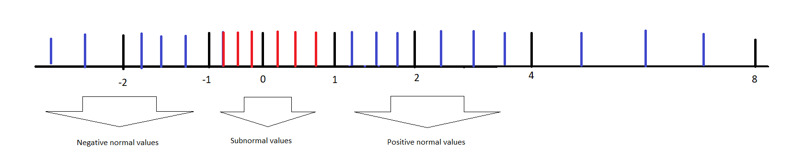

# Precision of floating point number

Precision of any system is the smallest change that can be observed in the system. In the floating point representation, the 'fractional' part of the number encoding decides the precision of the number. Higher the bits allocated for the fractional part, higher the precision would be. The smallest change that can be represented can be identified by flipping the LSB and observing the magnitude of change.
For example, an fractional field containing 10 bits would be able to represent `log10(2^10) = 3` decimal places. Where as a field containing 20 bits would be able to represent 6 decimal places. 
For an example lets say the sign bit is positive, exponent represents 10^-10. Then the fractional number would be `fraction * 2^-10`. If the fraction is three bits and 6 bits, the LSB change will have the following result:
```
3 bits:
010 => (1 + 2^-2) * 2^-10
011 => (1 + 2^-2 + 2^-3) * 2^-10
change: 2^-13

6 bits
000010 => (1 + 2^-5) * 2^-10
000011 => (1 + 2^-5 + 2^-6) * 2^-10
change: 2^-16
```

therefore 6 bit fractional part has higher precision than the 3 bit one. Sign does not contribute to precision. The exponent also does not contribute, it only helps in deciding the range.

# Normal and Subnormal values

A subnormal number is any number that is smaller than the smallest normally representable number. This is used for representing smaller numbers around the zero. In a normal number a leading 1 is assumed in the fractional part. By assuming this leading 1, we are increasing our precision but the lower limit is set to be 1. In a sub normal  number, the exponent is the lowest possible number, then the leading 1 is not assumed thereby allowing us to represent more smaller numbers around zero.

for example in a 3 bit system,
sign = +, exponent = 000 => 2^-4

if fraction = 000 is considered normal with leading bit: number = `1 * 2^-4` is the smallest number possible.
if fraction = 001 is considered subnormal without leading bit: number = `2^-6` is the smallest number possible.

But the precision has decreased due to loss of a bit. If we represent it in the number line, it might look like as follows:


So, subnormal numbers are used to represent small numbers around zero, with loss in precision. This is used in applications where underflow needs to be maganed with acceptable losses in precision.

# Rounding in floating point numbers

Not all floating point numbers can be represented exactly in the IEEE floating point representaion, hence five rounding rules have been putforth by IEEE. They are as follows,
 
(a) Round to nearest even number: rounds to the nearest value, but if it falls midway then it is rounded to the nearest value with an even least significant digit.
ex: 15.5 => 16

(b) Round to nearest, away from zero: rounds to the nearest value, but if it falls midway then it is rounded to the value away from zero.
ex: 15.5 => 16

(c) Rounded toward zero: Rounds towards the value towards zero
ex: 15.5 => 15

(d) Rounded toward infinity: Rounds towards the value towards infinity
ex: 15.5 => 16

(e) Rounded toward -infinity: Rounds towards the value towards -infinity
ex: 15.5 => 15
	-15.5 => -16
