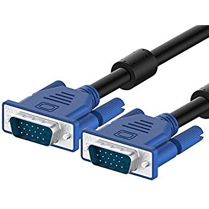
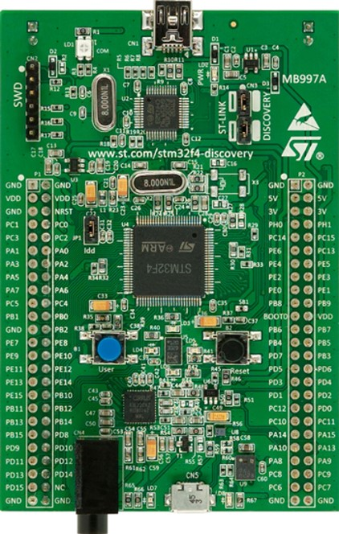
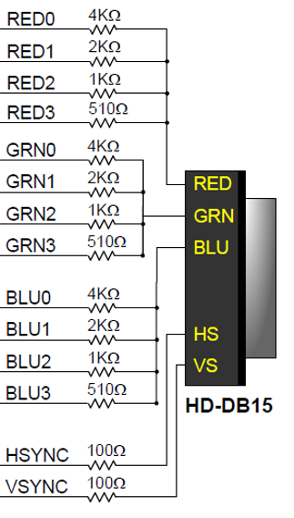
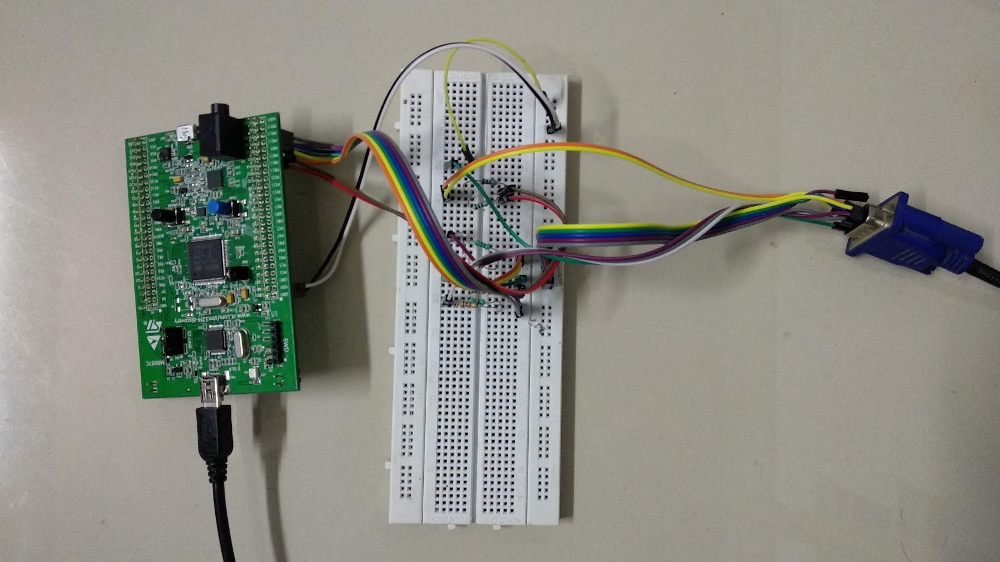
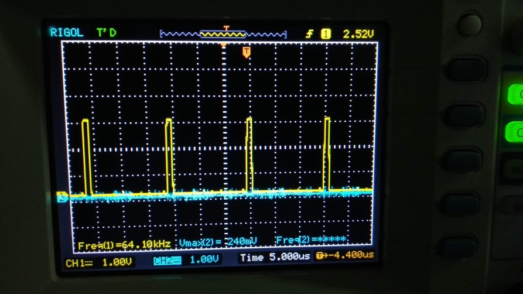
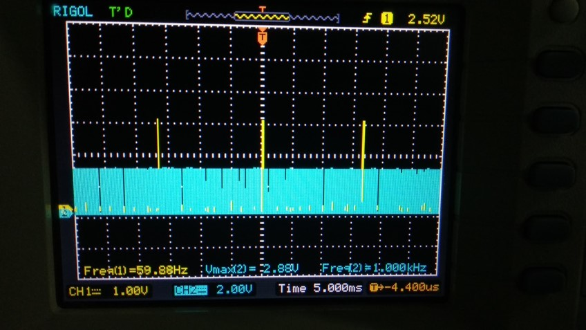
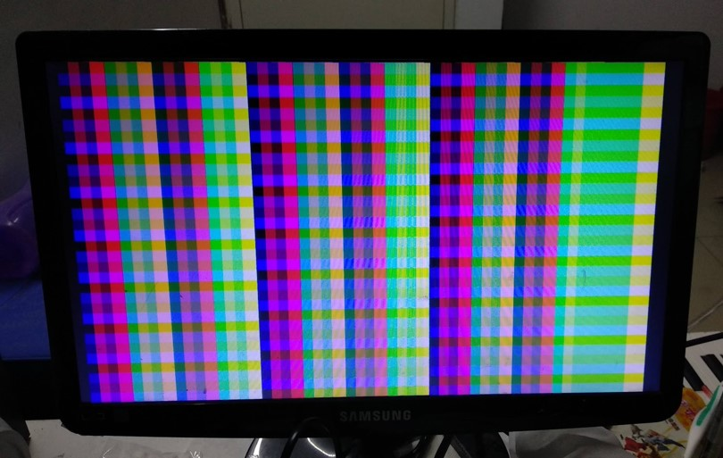
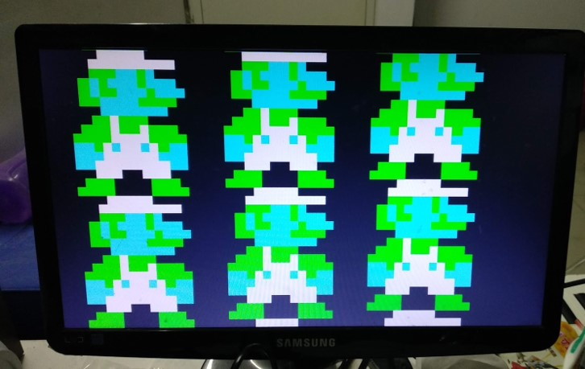

# ARM based VGA controller

## Introduction

VGA is a very widely used protocol for display. It is an analog protocol i.e. the signals are analog in nature. In this project I have tried to implement this protocol on an ARM board with the programming done in assembly. I have tried to implement the 1280x1025 @ 60Hz VGA timing. For more information and to learn how VGA works, following links are helpful.
* lslwww.epfl.ch/pages/teaching/cours_lsl/ca_es/VGA.pdf
* http://tinyvga.com/vga-timing/1280x1024@60Hz

## Hardware

The board used is STMF4 Discovery.

In order to generate the analog signals, a simple resister based DAC was used, as shown in the above image. Instead of 4bit R,G & B only two bits were used for each color

The following pin configuration was followed for the board. In total 8 GPIO pins were used.
* HSYNC: PD9
* VSYNC: PD8
* R0, R1: PD10, PD11
* G0, G1: PD12, PD13
* B0, B1: PD14, PD15

## Procedure
* Firstly the clock was increased to 168 MHz.
* Required GPIO were configured as required
* A timer (TIM2) was configured for HSYNC generation at 15.63uS period
* A interrupt service routine was written to service this timer interrupt
* HSYNC generation was completed and tested on the oscilloscope to verify that the timings are met.
* VSYNC generation was completed and tested on the oscilloscope to verify that the timings are met.
* A sloid color was given and tested on a VGA monitor.
* All possible colors were displayed and tested on the VGA monitor.
* A simple bitmap image was shown on the screen.

## Challenges
* Increasing clock to 168MHz was tedious. Several kinds of configurations had to be made to achieve this, such as enabling the external oscillator, enabling the PLL, ensuring that they are configured correctly etc.
* Working with NVIC to control the interrupts from the timer to get required frequency.
* Needed a clock frequency of 108 MHz, but ended up at ~5MHz: Because of loop instructions
* Hence only about 50+ pixels in a line, hence only some bitmaps can be shown, but able to achieve 1024 lines
* Space to store the large images is also an issue, hence showing bitmaps is easier (because of the keil lite 32KB restriction)

## Results

HSYNC (Required 64kHz)

VSYNC (Required 60Hz)

Displaying all possible colors

Displaying a bitmap image

## Code
Can be found at https://github.com/7andahalf/ARM_class/tree/master/project

## References & Images from
* https://en.wikipedia.org/wiki/VGA_connector
* http://tinyvga.com/vga-timing/1280x1024@60Hz
* https://reference.digilentinc.com/basys3/refmanual
* https://www.amazon.com/Rankie-VGA-Cable-Feet/dp/B01KRLYPNE
* https://reference.digilentinc.com/basys3/refmanual
* https://www.element14.com/community/docs/DOC-80768/l/discovery-kit-with-stm32f407vg-microcontroller-unit

